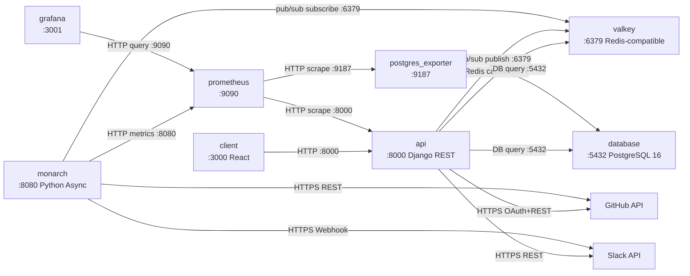

# System Map (AI)

## 1. System Diagram

```mermaid
graph LR
    client["client\n:3000 React"]
    api["api\n:8000 Django REST"]
    database["database\n:5432 PostgreSQL 16"]
    valkey["valkey\n:6379 Redis-compatible"]
    monarch["monarch\n:8080 Python Async"]
    prometheus["prometheus\n:9090"]
    grafana["grafana\n:3001"]
    pg_exporter["postgres_exporter\n:9187"]
    github["GitHub API"]
    slack["Slack API"]

    client      -->|"HTTP :8000"| api
    api         -->|"DB query :5432"| database
    api         -->|"Redis cache :6379"| valkey
    api         -->|"pub/sub publish :6379"| valkey
    monarch     -->|"pub/sub subscribe :6379"| valkey
    monarch     -->|"HTTP metrics :8080"| prometheus
    prometheus  -->|"HTTP scrape :8000"| api
    prometheus  -->|"HTTP scrape :9187"| pg_exporter
    pg_exporter -->|"DB query :5432"| database
    grafana     -->|"HTTP query :9090"| prometheus
    api         -->|"HTTPS OAuth+REST"| github
    api         -->|"HTTPS REST"| slack
    monarch     -->|"HTTPS REST"| github
    monarch     -->|"HTTPS Webhook"| slack
```
